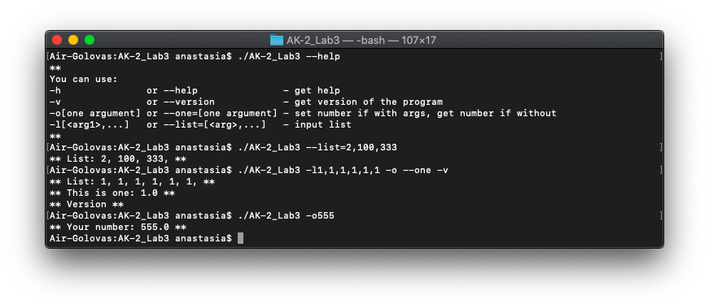

# AK-2 Lab3 
## Виконала: Головаш Анастасія 
## Група: ІВ-82

## Ключі та параметри:
```
-h               or --help               - get help
-v               or --version            - get version of the program
-o[one argument] or --one=[one argument] - set number if with arg, get number if without
-l[<arg1>,...]   or --list=[<arg>,...]   - input list
```

## Результат роботи програми:


## Висновки:
Під час виконання лабораторної роботи було розроблено програму на C++, яка приймає і аналізує будь-яку кількість параметрів командного рядка.
